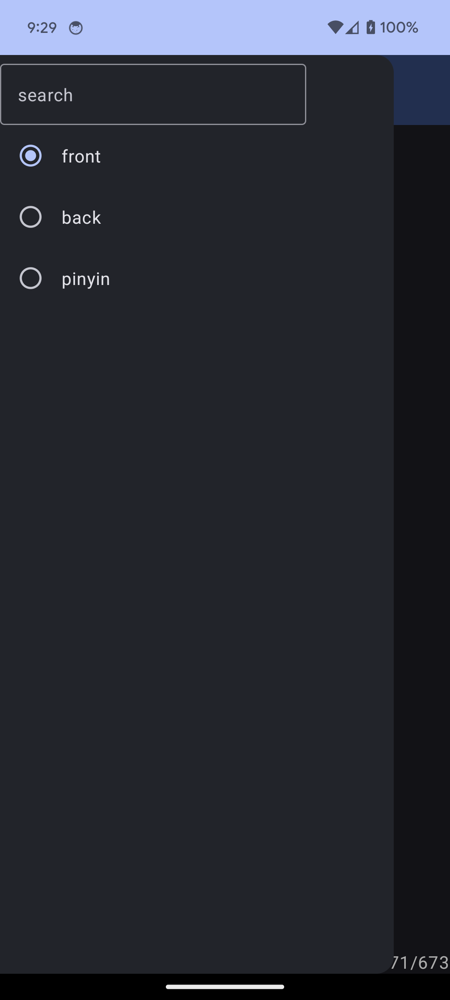

# flashcards       
    
This app currently just has cards for Chinese characters/words, which is based off https://github.com/syncopika/flashcards but it can be made more generic pretty easily I think for other subjects! :D    
    
You can traverse the cards by swiping left and right. Tapping on the card will flip it. You can also search for a specific card based on the card text.   
    
some screenshots:    
   
     
    