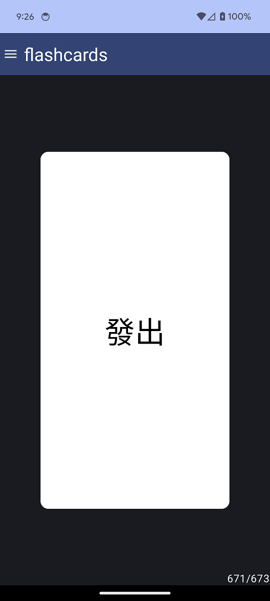
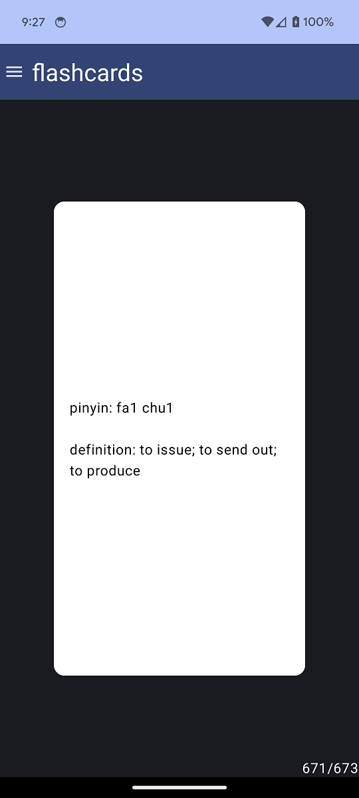

# flashcards       
    
This app currently just has cards for Chinese characters/words, which is based off https://github.com/syncopika/flashcards but it can be made more generic pretty easily I think for other subjects! :D    
    
You can traverse the cards by swiping left and right. Tapping on the card will flip it. You can also search for a specific card based on the card text.   
    
some screenshots:    
   
     
    
    
clicking on the pencil icon in the search box will present a canvas that you can write on, which allows you to search based on a specific Chinese character. The character recognition is powered by Google's ML Kit, and may not always be 100% accurate.    
    
    